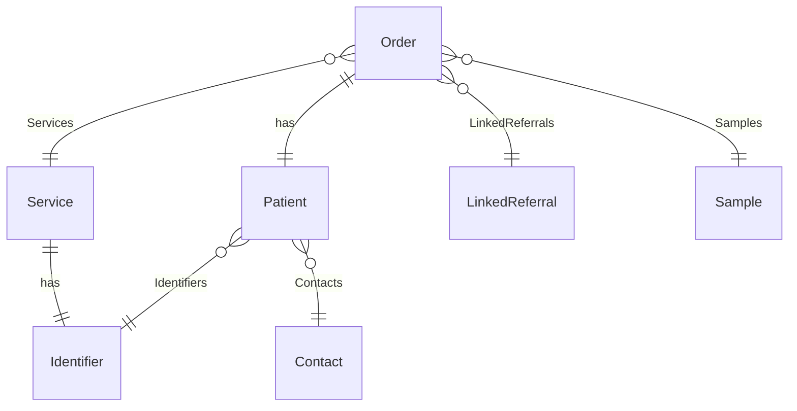

#  Arenal Client

This project is a .NET data model and web client for [Arenal](https://awp.skyware-group.com/) service.

## Model

```mermaid
erDiagram
    Order ||--|| Patient : has
    Order }o--|| Service : Services
    Order }o--|| LinkedReferral : LinkedReferrals
    Order }o--|| Sample : Samples
    Service ||--|| Identifier : has
    Patient }o--|| Identifier : Identifiers
    Patient }o--|| Contact : Contacts
```
