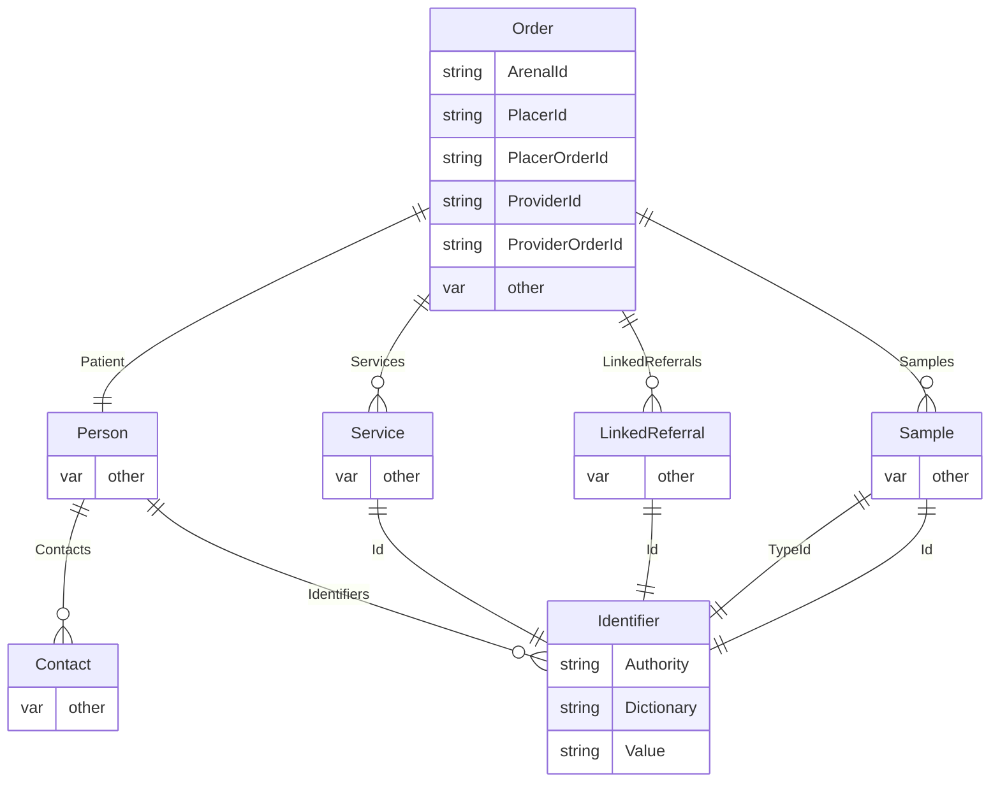

#  Arenal Client

This project is a .NET data model and web client for [Arenal](https://awp.skyware-group.com/) service.

## Order Model

## Identifiers

| Authority | Identfier type | Applicable country | Dictionaries | Notes |
| :---  | :---  | :---  | :---  | :---  |
| `bg.bma` | УИН | Bulgaria | None | |
| `bg.brra` | ЕИК | Bulgaria | None | |
| `bg.grao` | ЕГН | Bulgaria | None | |
| `bg.his` | ЕГН | Bulgaria | НЗИС номенклатура | Use for test and sample typr identification |
| `bg.mi` | ЛНЧ | Bulgaria | None |  |
| `bg.mh` | РЦЗ/РЗИ код | Bulgaria | None | |
| `bg.nhis` | Продукт/ЛЗ | Bulgaria | `prod`, `org` | При речник `prod` - код на изследване, кл. патека и др., при `org` - НЗОК номер на ЛЗ |
| `eu.vies` | EU VAT number | EU countries | None | |
| `org.loinc` | Loinc code | All | HL7 table | Use for test and sample typr identification |

