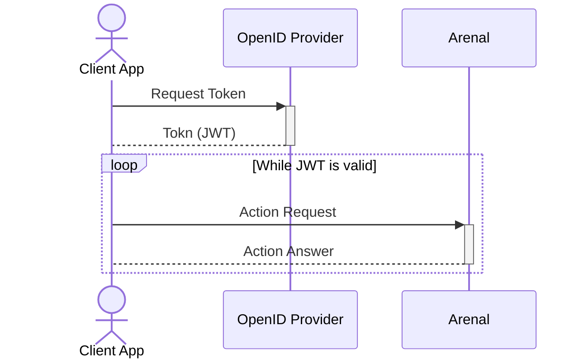

# Authentication and Authorization


Authentication and Authorization in Arenal are compatable with [OpenID Connect](https://openid.net/connect/) protocol.

## Machine to machine (M2M)

In M2M case, clieant application request [JWT](https://jwt.io/) without interaction with the user and uses it for further interaction with Arenal.



Example C# code looks like this:

```c#
using IdentityModel.Client;
using IdentityModel.Client;
using Skyware.Arenal.Client;
using Skyware.Arenal.Model;
using System.Text.Json;

namespace CliTestApp
{
    public class Program
    {

        private TokenResponse? _tokenResponse = null;

        /// <summary>
        /// Demonstrates how to obtain and cache JWT
        /// </summary>
        /// <returns></returns>
        private async Task<string> GetTokenAsync()
        {
            if (_tokenResponse == null)
            {
                using var client = new HttpClient();
                //Authenticate
                _tokenResponse = await client.RequestPasswordTokenAsync(new PasswordTokenRequest
                {
                    Address = "https://kc-dev.skyware-group.com/realms/arenal-dev/protocol/openid-connect/token",
                    ClientId = "api-client",
                    ClientSecret = "secret",
                    Scope = "api-scope",
                    UserName = "user",
                    Password = "password"
                });
            }
            return _tokenResponse.AccessToken;
        }

        private async Task<Order> PublisOrderAsync(Order order)
        {
            using var client = new HttpClient();
            client.SetBearerToken(await GetTokenAsync());
            return await client.CreateOrdersAsync(order);
        }

        async Task Main(string[] args)
        {
            Order order = new Order()
            {
                Patient = new Person() 
                { 
                    GivenName = "Misho" 
                    //Other properties
                }
                //Other properties
            };
            Order respOrd = await PublisOrderAsync(order);
            Console.WriteLine($"Order created, ArenalId is: {respOrd.ArenalId}");
            //Other interactions with Arenal
        }
       
    }
}

```
