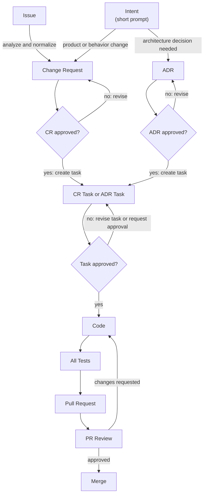

# AI-Native Development Process

Status: Approved

This folder documents the AI-native, agentic development process for this repository. The process is designed to be readable by humans and directly usable by coding agents. The central rule is simple: agents may transform, validate, and synchronize work, but every boundary must produce a reviewable artifact.

## Scope

Included for now:

* Issue -> Change Request -> approved CR -> CR Task
* Intent -> Change Request or ADR -> approved artifact -> Task
* ADR -> approved ADR -> ADR Task
* Approved ADR or CR Task -> Code -> all tests -> PR
* PR Review -> Merge

Out of scope for now:

* Build artifacts
* Release packaging
* Deployment and environment rollout

## Process Map



## Principles

* Keep every step artifact-driven: source, reasoning, implementation, and review must be traceable.
* Prefer small tasks with explicit acceptance criteria over broad prompts.
* Record unknowns early. Do not hide assumptions inside code changes.
* Use agents for analysis, drafting, implementation, test generation, review assistance, and synchronization.
* Use humans for ownership, prioritization, architectural approval, final acceptance, and risk decisions.
* Make files easy to locate by type, date, and short slug.
* Keep Markdown compatible with VS Code preview, GitHub, and Mermaid renderers.

## Recommended File Structure

The process documentation lives here:

```text
docs/
  dev-process/
    README.md
    issue-to-change-request.md
    intent-to-change-request-or-adr.md
    adr-to-adr-task.md
    task-to-code-test-pr.md
    pr-review-to-merge.md
    skills-how-to.md
```

When real work artifacts are introduced, use a predictable structure:

```text
docs/
  adr/
    ADR-YYYYMMDD-short-slug.md
  change-requests/
    CR-YYYYMMDD-short-slug.md
  tasks/
    CR-TASK-YYYYMMDD-short-slug.md
    ADR-TASK-YYYYMMDD-short-slug.md
```

## Naming Convention

Use lowercase slugs with hyphens. Keep names stable after review starts.

| Artifact | Pattern | Example |
| --- | --- | --- |
| ADR | `ADR-YYYYMMDD-short-slug.md` | `ADR-20260525-auth-boundaries.md` |
| Change Request | `CR-YYYYMMDD-short-slug.md` | `CR-20260525-order-search.md` |
| CR Task | `CR-TASK-YYYYMMDD-short-slug.md` | `CR-TASK-20260525-order-search-api.md` |
| ADR Task | `ADR-TASK-YYYYMMDD-short-slug.md` | `ADR-TASK-20260525-auth-boundaries.md` |
| Branch | `<agent-name>/<artifact-id>-short-slug` | `codex/cr-task-20260525-order-search-api` |
| PR Title | `<artifact-id>: short summary` | `CR-TASK-20260525-order-search-api: add order search endpoint` |

## Status Model

Use a small status vocabulary and write the status near the top of each artifact.

| Status | Meaning |
| --- | --- |
| `Draft` | Work is being shaped. Open questions are allowed. |
| `Ready` | Scope and acceptance criteria are clear enough for approval review. |
| `In Progress` | A human or agent is actively changing code or docs. |
| `Review` | The work is in PR review or formal human review. |
| `Changes Requested` | Review found required changes before approval. |
| `Approved` | The owner accepts the CR, ADR, task, or PR. Approved CRs and ADRs may produce implementation tasks. |
| `Merged` | The implementation PR has been merged. |
| `Closed` | No further work is planned for this artifact. |

`Draft` artifacts do not move to the next process step. A human or agent may write or revise a `Draft` artifact, but the next step requires approval. Only a human owner may approve an artifact, either by changing its status to `Approved` or by explicitly instructing an agent to mark it `Approved`. After approval, a human or agent may move implementation artifacts to `Merged` or `Closed` when the repository state supports that status.

## Authorship And Ownership

Each work artifact should include:

```yaml
id: CR-YYYYMMDD-short-slug
type: change-request
status: Draft
owner: "@github-user-or-team"
authors:
  humans:
    - "@github-user"
  agents:
    - "Codex"
agent_context:
  agent: "Codex"
  model: "model name when known"
  tools:
    - "tool name when relevant"
source:
  type: issue
  ref: "#123"
created: YYYY-MM-DD
updated: YYYY-MM-DD
```

Authorship records who contributed text, code, or analysis. Ownership records who can decide scope, approval, and merge readiness. Record agent names, model names, and important tool names when they are known.

## Agent-Friendly Markdown Rules

* Use one `#` heading per file.
* Keep sections short and consistently named.
* Prefer tables for metadata and status mapping.
* Use fenced code blocks with language tags.
* Use Mermaid diagrams for process flow.
* Keep links relative inside the repository.
* Write process artifacts in English, regardless of the prompt language.
* Put unresolved questions in the current artifact instead of burying them in prose.

## Detailed Flows

* [Issue -> Change Request](issue-to-change-request.md)
* [Intent -> Change Request or ADR](intent-to-change-request-or-adr.md)
* [Approved ADR -> ADR Task](adr-to-adr-task.md)
* [Approved ADR or CR Task -> Code -> Test -> PR](task-to-code-test-pr.md)
* [PR Review -> Merge](pr-review-to-merge.md)
* [Process Skills How-To](skills-how-to.md)

CR Tasks are created from approved Change Requests by explicit prompt or repository skill. They use the task skeleton in [Approved ADR or CR Task -> Code -> Test -> PR](task-to-code-test-pr.md).

