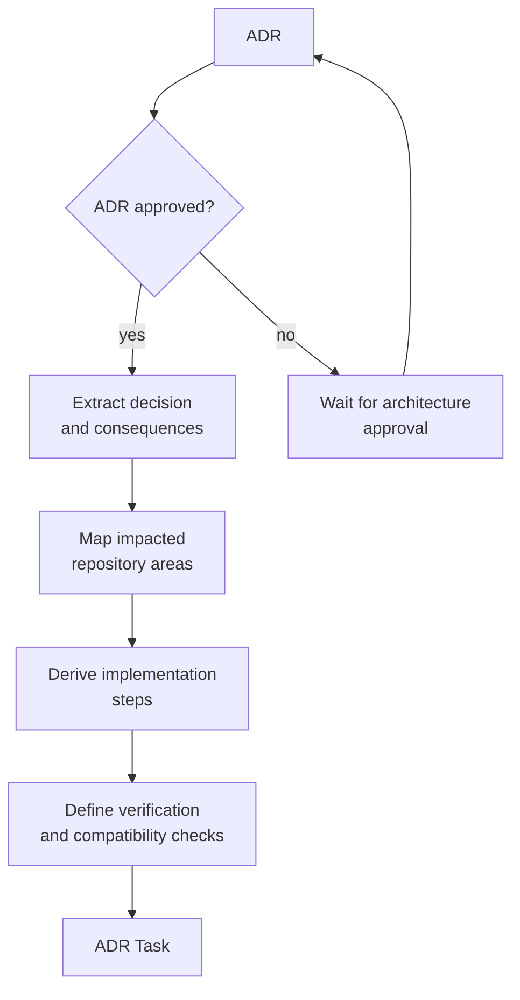

# ADR -> ADR Task

Status: Approved

This flow converts an approved Architecture Decision Record into implementation work. ADR Tasks should preserve the decision context while making the required code, configuration, documentation, or tests actionable.

## Goal

Ensure approved architectural decisions become concrete repository changes and remain traceable back to the ADR.

## Inputs

| Input | Required | Notes |
| --- | --- | --- |
| ADR | Yes | Must be approved and include decision, context, and consequences. |
| Affected boundaries | Preferred | Projects, modules, APIs, storage, security, infrastructure, or integration points. |
| Migration notes | Optional | Needed when existing behavior or data must move. |
| Compatibility constraints | Optional | Backward compatibility, rollout order, versioning, or client impact. |

## Output

An `ADR-TASK-YYYYMMDD-short-slug.md` task with:

* Approved ADR reference
* Implementation objective
* Impacted components
* Required code and documentation changes
* Verification plan
* Rollback or migration concerns when relevant

## Flow



## Agent Responsibilities

* Extract the implementation consequences from the ADR.
* Identify likely repository boundaries affected by the decision.
* Propose ordered steps that minimize risk.
* Flag missing migration, compatibility, or test guidance.
* Keep the task aligned with the accepted decision instead of reopening the ADR.

## Human Responsibilities

* Approve the ADR before ADR Tasks are created.
* Approve the ADR Task before implementation starts, either directly or by explicitly instructing an agent to mark it `Approved`.
* Confirm acceptable risk and rollout constraints.
* Decide whether implementation can be split into multiple ADR Tasks.

## Suggested ADR Task Skeleton

```markdown
# ADR-TASK-YYYYMMDD-short-slug

Status: Draft
Source: ADR-YYYYMMDD-short-slug
Owner: @owner
Authors: @human, Codex
Agent Context: agent/model/tools when known

## Decision Summary

## Implementation Objective

## Impacted Areas

## Required Changes

## Verification Plan

## Compatibility And Migration Notes

## Open Questions
```

## Status Rules

| From | To | Condition |
| --- | --- | --- |
| `Draft` | `Ready` | Approved ADR exists and implementation scope is clear. |
| `Ready` | `Approved` | Human owner approves the task or explicitly instructs an agent to approve it. |
| `Approved` | `In Progress` | Implementation starts. |
| `Draft` | `Closed` | ADR is rejected, superseded, or split into other tasks. |

