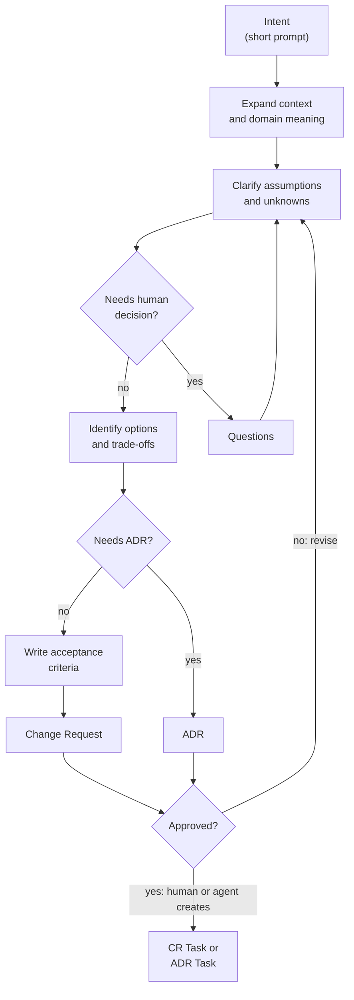

# Intent -> Change Request Or ADR

Status: Approved

This flow converts a short intent prompt into an approvable Change Request or Architecture Decision Record. Intent is less concrete than an issue: it describes direction, desired capability, or product outcome before the exact change is known.

## Goal

Turn a short prompt into the right approval artifact without overfitting the first wording of the request. A human or agent creates implementation tasks only after the Change Request or ADR is approved.

## Inputs

| Input | Required | Notes |
| --- | --- | --- |
| Intent prompt | Yes | One or more sentences describing the desired outcome. |
| Context | Preferred | Domain, user role, workflow, or affected product area. |
| Constraints | Preferred | Timeline, compatibility, data, security, or architecture constraints. |
| Examples | Optional | Similar screens, APIs, behavior, or expected outputs. |

## Output

One of:

* A `CR-YYYYMMDD-short-slug.md` Change Request for product, behavior, documentation, or implementation-scoped change.
* An `ADR-YYYYMMDD-short-slug.md` Architecture Decision Record when the intent requires an architectural decision.

The artifact should include:

* Clarified intent
* Proposed scope
* Alternatives considered
* Acceptance criteria
* Risks and assumptions
* Open questions when the intent is not yet safe to implement

## Flow



## Agent Responsibilities

* Restate the intent in precise product and technical language.
* Identify likely affected areas in the repository.
* Suggest a narrow first Change Request when the intent is broad.
* Route architectural decisions to ADR instead of hiding them inside a Change Request.
* Separate assumptions from confirmed facts.
* Avoid inventing business rules that require owner approval.
* Draft implementation tasks only after the CR or ADR is approved.

## Human Responsibilities

* Confirm the desired outcome.
* Choose between meaningful product or architectural alternatives.
* Approve the Change Request or ADR before implementation tasks are created.

## Suggested Change Request Skeleton

```markdown
# CR-YYYYMMDD-short-slug

Status: Draft
Source: Intent
Owner: @owner
Authors: @human, Codex
Agent Context: agent/model/tools when known

## Intent

## Clarified Goal

## Scope

## Non-Scope

## Alternatives Considered

## Acceptance Criteria

## Risks And Assumptions

## Open Questions
```

## Suggested ADR Skeleton

```markdown
# ADR-YYYYMMDD-short-slug

Status: Draft
Source: Intent
Owner: @owner
Authors: @human, Codex
Agent Context: agent/model/tools when known

## Context

## Decision

## Alternatives Considered

## Consequences

## Follow-Up Tasks
```

## Task Creation Rule

After the Change Request reaches `Approved`, a human or agent creates one or more `CR-TASK-YYYYMMDD-short-slug.md` tasks under `docs/tasks/`. After the ADR reaches `Approved`, a human or agent creates one or more `ADR-TASK-YYYYMMDD-short-slug.md` tasks under `docs/tasks/`. The task starts as `Draft` or `Ready`; implementation starts only after the task itself reaches `Approved`.

## Status Rules

| From | To | Condition |
| --- | --- | --- |
| `Draft` | `Ready` | Artifact is clear enough for owner approval review. |
| `Ready` | `Approved` | Owner accepts the Change Request or ADR. |
| `Ready` | `Changes Requested` | Owner requires clarification or scope changes. |
| `Changes Requested` | `Ready` | Requested updates are made. |
| `Approved` | `In Progress` | A linked CR Task or ADR Task is created. |
| `Draft` | `Closed` | The intent is superseded or intentionally deferred. |

