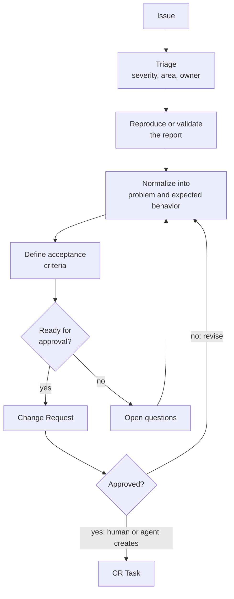

# Issue -> Change Request

Status: Approved

This flow converts a concrete issue into an approvable Change Request. An issue can be a bug report, support case, customer request, observed production behavior, or internal defect.

## Goal

Transform an issue into a Change Request that preserves the original context and is clear enough for approval. A human or agent creates the CR Task only after the Change Request is approved.

## Inputs

| Input | Required | Notes |
| --- | --- | --- |
| Issue title and description | Yes | Link to the original issue when available. |
| Observed behavior | Yes | Include logs, screenshots, API payloads, or reproduction notes when useful. |
| Expected behavior | Yes | State the desired result in user-visible terms. |
| Affected area | Preferred | Module, API, page, workflow, or data model. |
| Constraints | Preferred | Security, compatibility, performance, migration, or release constraints. |

## Output

A `CR-YYYYMMDD-short-slug.md` Change Request with:

* Source issue reference
* Problem statement
* Scope and non-scope
* Acceptance criteria
* Suggested files or components to inspect
* Test expectations
* Unknowns or follow-up questions

## Flow



## Agent Responsibilities

* Extract symptoms, expected behavior, affected area, and constraints.
* Check whether the issue is actionable from the available evidence.
* Propose acceptance criteria in testable language.
* Mark assumptions explicitly.
* Draft the Change Request and, after approval, draft the CR Task.
* Add open questions to the Change Request when they affect the requested change.

## Human Responsibilities

* Confirm priority and owner.
* Confirm business meaning and acceptance criteria.
* Approve, reject, or request changes to the Change Request.
* Decide whether an approved Change Request should produce one task or several tasks.

## Suggested Change Request Skeleton

```markdown
# CR-YYYYMMDD-short-slug

Status: Draft
Source: Issue #123
Owner: @owner
Authors: @human, Codex
Agent Context: agent/model/tools when known

## Problem

## Scope

## Non-Scope

## Acceptance Criteria

## Implementation Notes

## Test Expectations

## Open Questions
```

## Task Creation Rule

After the Change Request reaches `Approved`, a human or agent creates one or more `CR-TASK-YYYYMMDD-short-slug.md` tasks under `docs/tasks/`. The task must link back to the approved Change Request and must not broaden the approved scope. The task starts as `Draft` or `Ready`; implementation starts only after the task itself reaches `Approved`.

## Status Rules

| From | To | Condition |
| --- | --- | --- |
| `Draft` | `Ready` | Problem, scope, and acceptance criteria are clear enough for approval review. |
| `Ready` | `Approved` | Owner accepts the Change Request. |
| `Ready` | `Changes Requested` | Owner requires clarification or scope changes. |
| `Changes Requested` | `Ready` | Requested updates are made. |
| `Approved` | `In Progress` | A linked CR Task is created. |
| `Draft` | `Closed` | The issue is duplicate, invalid, or intentionally not planned. |

