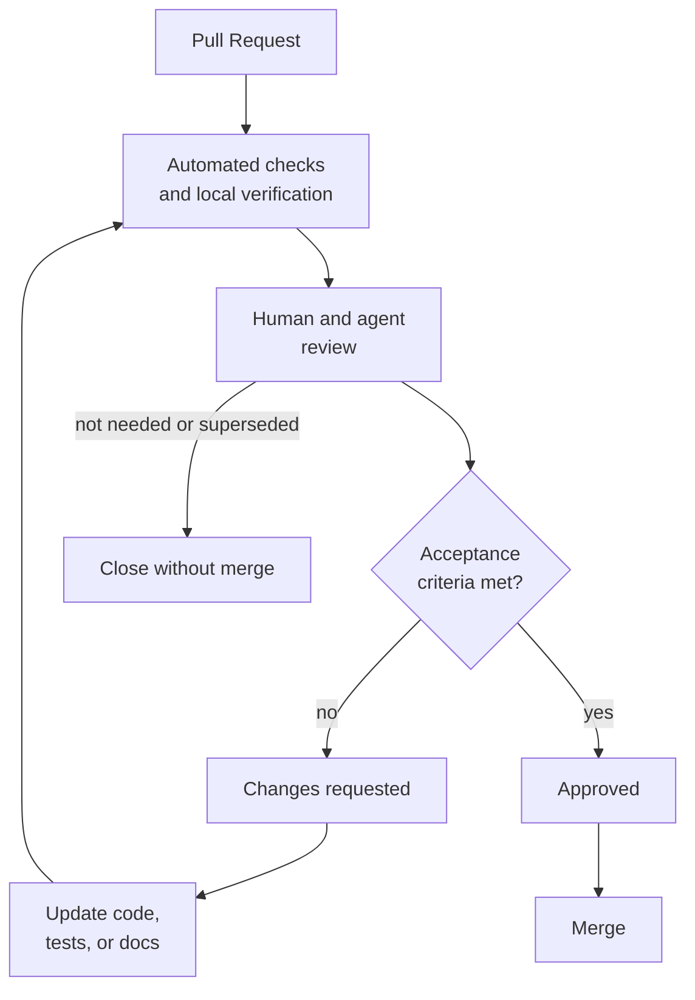

# PR Review -> Merge

Status: Approved

This flow describes how a Pull Request is reviewed and merged. Review should evaluate code, tests, docs, task alignment, and reasoning together.

## Goal

Merge only changes that satisfy the source task, preserve repository quality, and leave future humans and agents with enough context.

## Inputs

| Input | Required | Notes |
| --- | --- | --- |
| Pull Request | Yes | Must link the source CR Task or ADR Task. |
| Source task | Yes | Acceptance criteria are the review checklist. |
| Verification results | Yes | Automated tests, manual checks, or explicit skipped-test rationale. |
| Reviewer comments | Preferred | Human comments may be assisted by agents. |

## Output

A merged PR or a clear set of requested changes.

## Flow

## Review Checklist

* The PR links to the source task.
* The PR uses the repository PR template and includes the source task link.
* The implementation satisfies the acceptance criteria.
* Scope changes are explained.
* Tests or skipped-test rationale match the risk.
* Documentation is updated when behavior, process, or architecture changed.
* Security, compatibility, and data-impact concerns are considered.
* The final diff does not include unrelated changes.

## Agent Responsibilities

* Assist with static review, test-gap detection, and PR summary drafting.
* Compare the diff against the source task and acceptance criteria.
* Identify risky assumptions and missing verification.
* Avoid approving or merging unless explicitly authorized by the human owner.

## Human Responsibilities

* Make the approval decision.
* Decide whether unresolved comments block merge.
* Confirm the merge strategy and timing.

## Merge Rules

| Rule | Requirement |
| --- | --- |
| Source traceability | PR must link the task or ADR Task. |
| Review ownership | At least one responsible human reviewer approves. |
| Checks | All repository tests pass or an owner documents the exception. |
| Task status | Source task moves to `Merged` after merge. |
| Follow-up work | New issues or tasks are created for accepted leftovers. |

## Status Rules

| From | To | Condition |
| --- | --- | --- |
| `Review` | `Changes Requested` | Reviewer requires updates. |
| `Changes Requested` | `Review` | Author updates the PR and requests another review. |
| `Review` | `Approved` | Human reviewer accepts the PR. |
| `Approved` | `Merged` | PR is merged. |
| `Review` | `Closed` | PR is abandoned, duplicated, or superseded. |

