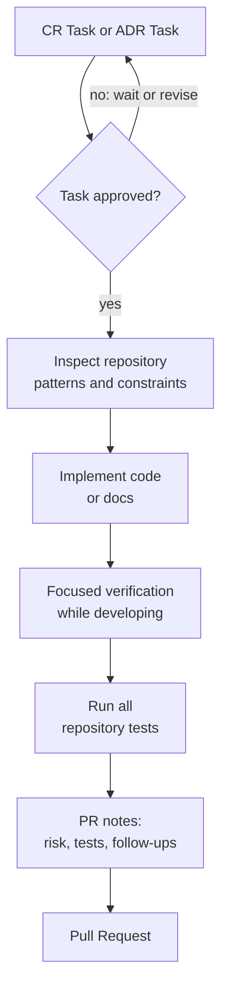

# Approved ADR or CR Task -> Code -> Test -> PR

Status: Approved

This flow turns an approved CR Task or ADR Task into code, tests, and a Pull Request. A CR Task must come from an approved Change Request, and an ADR Task must come from an approved ADR. All repository tests are expected before PR unless the human owner explicitly accepts an exception; the reason should be stated in the PR.

## Goal

Implement the task with enough verification and traceability for review.

## Inputs

| Input | Required | Notes |
| --- | --- | --- |
| CR Task or ADR Task | Yes | Status must be `Approved` and linked to an approved CR or ADR. |
| Acceptance criteria | Yes | Used as the implementation checklist. |
| Repository context | Yes | Existing code patterns, tests, docs, and configuration. |
| Human constraints | Preferred | Time, compatibility, release, or review expectations. |

## Output

A Pull Request containing:

* Code changes
* Test updates when appropriate
* Documentation updates when behavior or process changes
* PR description linking the source task
* Notes for skipped tests or known follow-up work

## Flow



## Agent Responsibilities

* Read existing code and tests before editing.
* Confirm that the task links to an approved Change Request or ADR.
* Confirm that the task itself is `Approved`.
* Keep changes scoped to the task.
* Preserve unrelated user changes in the working tree.
* Add or update tests when they provide meaningful confidence.
* Run focused verification while developing, then run all repository tests before PR.
* Summarize implementation decisions in the PR description.

## Human Responsibilities

* Confirm scope changes that appear during implementation.
* Review behavior, risk, and acceptance criteria.
* Decide whether skipped tests are acceptable.

## Branch And PR Convention

| Item | Convention |
| --- | --- |
| Branch | `<agent-name>/<task-id>-short-slug` |
| Commit | Short imperative summary referencing the task when useful |
| PR title | `<task-id>: short summary` |
| PR body | Required source task link, summary, verification, risks, screenshots or API examples when useful |

## Suggested CR Task Skeleton

```markdown
# CR-TASK-YYYYMMDD-short-slug

Status: Draft
Source: ../change-requests/CR-YYYYMMDD-short-slug.md
Owner: @owner
Authors: @human, Codex
Agent Context: agent/model/tools when known

## Change Request Summary

## Implementation Objective

## Scope

## Non-Scope

## Acceptance Criteria

## Impacted Areas

## Required Changes

## Verification Plan

## Risks And Assumptions

## Open Questions
```

Move the task to `Approved` only when the human owner approves it directly or explicitly instructs an agent to mark it `Approved`.

## Test Guidance

| Change Type | Expected Verification |
| --- | --- |
| Pure documentation | Link/path check when practical plus all repository tests before PR unless explicitly waived |
| Small isolated logic | Focused unit test plus all repository tests |
| API behavior | Focused unit, request-level, or integration test plus all repository tests |
| Data access or external service boundary | Integration, contract, or documented manual verification plus all repository tests |
| Architecture change | Focused tests, ADR consequence review, and all repository tests |

## Status Rules

| From | To | Condition |
| --- | --- | --- |
| `Draft` | `Ready` | Task is clear enough for owner approval review. |
| `Ready` | `Approved` | Human owner approves the task or explicitly instructs an agent to approve it. |
| `Approved` | `In Progress` | Code or docs changes begin. |
| `In Progress` | `Review` | PR is opened with verification notes. |
| `Review` | `Changes Requested` | Reviewer requires changes. |
| `Review` | `Approved` | Reviewer accepts the PR. |

